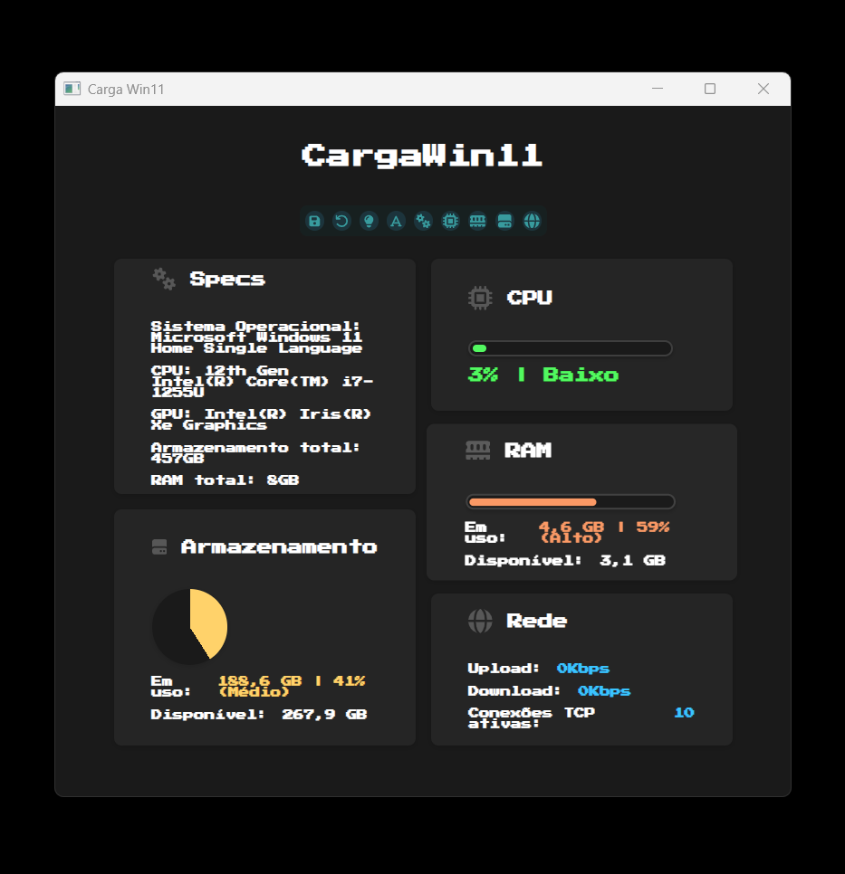
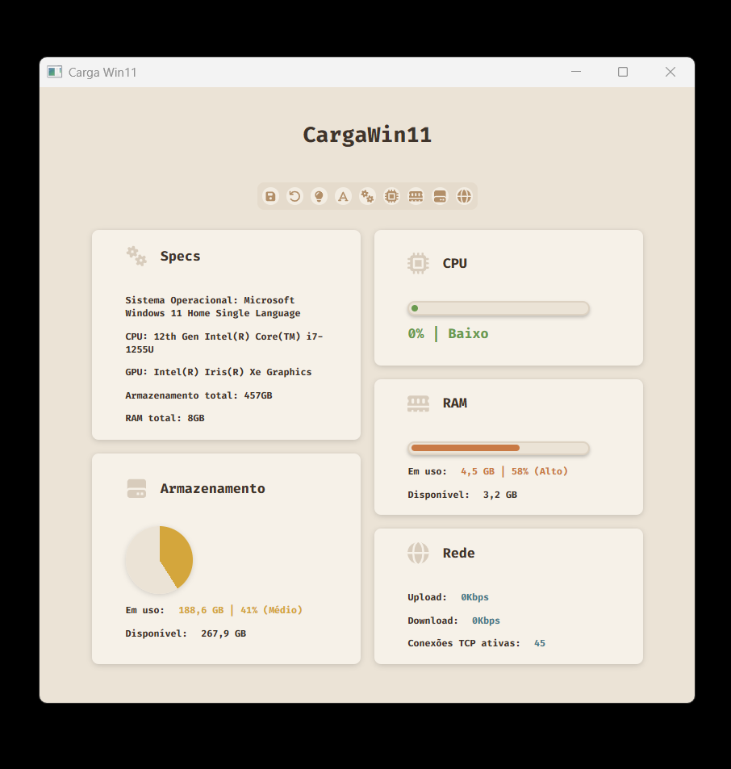

<h1 align="center">CargaWin11</h1>

  

## Sobre
Aplicação nativa pro Windows 11 que consiste em um mini dashboard de monitoramento de sistema. A aplicação foi inspirada em ferramentas como o Gerenciador de Tarefas do Windows e o Conky disponível para sistemas Unix-like. 

O objetivo da aplicação é exibir informações em tempo real sobre CPU, RAM, armazenamento e rede, com interface dinâmica e personalizável a qual permite ao usuário escolher entre diferentes temas de cores e fontes. 

A aplicação foi desenvolvida sobretudo com a linguagem C# utilizando os frameworks Blazor e WPF.

### 🚀 Recursos
- Coleta de dados sobre a carga do sistema com WMI e outras bibliotecas C#
- Monitoramento de carga de:
  - CPU
  - RAM
  - Armazenamento no disco C:
  - Rede:
    - Upload (Kbps)
    - Download (Kbps)
    - Conexões TCP ativas
- Atualização em tempo real do dashboard
- Visualização de carga do sistema através de gráficos e textos na interface
- Personalização da interface pelo usuário através de temas e fontes pré definidos
- Salvar preferências do usuário em arquivos JSON

### 🛠️ Tecnologias utilizadas
- .NET 8:
  - C#
  - WPF
  - Blazor
- Web:
  - HTML
  - CSS
  - JavaScript
